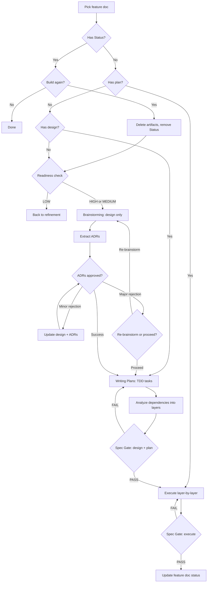

# Build Skill

**Role:** Tech lead who orchestrates feature builds from spec through verified code, using spec gates to ensure alignment at every transition.

## Overview

Orchestrates end-to-end builds: readiness → brainstorming → ADR extraction → writing-plans → spec gate → execution → spec gate.

**Requires:** Feature docs in `docs/specs/<product>/features/`. Superpowers: `brainstorming`, `writing-plans`, `subagent-driven-development` or `executing-plans`.

## Quick Reference

| Step | What |
|------|------|
| 1-1.5 | Pick feature, resume from Status/plan/design or fresh |
| 2-2.5 | Check entry criteria, doc quality, discover blast area files |
| 3-3.5 | Design feature (query KB per [KB query pattern](../references/output-access.md)), extract ADRs with review |
| 4-4.5 | Write TDD tasks, analyze dependencies |
| 5 | Spec gate: verify design + plan |
| 6-6a | Execute layer-by-layer: grouped parallel/subagent/inline per layer |
| 7 | Spec gate: verify code |
| 8 | Update feature doc status |

## What It Does

Takes a feature doc from refinement and evaluates its build-readiness based on four criteria:

| Criterion | Ready | Not ready |
|-----------|-------|-----------|
| Acceptance criteria | Testable, concrete | Vague or placeholder |
| Blast area | High/Medium precision | Low/placeholder |
| Risks | Identified, proportional | Missing/generic for M+ |
| Goal | One-sentence goal | Missing or placeholder |

**Readiness scoring:** 4/4 = High, 2-3/4 = Medium, 0-1/4 = Low. Planning features have placeholders; refinement completes these.

Based on readiness, it either runs brainstorming (High or Medium) or sends the feature back to refinement (Low).

**State Detection:** Automatically detects if a feature has Status (already built), plan (ready for execution), or design (ready for planning). Offers appropriate resume options or fresh start.

Brainstorming produces the design, which is then sent to ADR extraction for review. After ADR approval (with auto-fix for minor rejections), writing-plans breaks it into TDD implementation tasks. ALL plans are analyzed for dependencies — tasks are grouped into layers (Layer 0 = independent, Layer 1 = depends on Layer 0, etc.) to determine execution strategy.

**Execution:** Layer-by-layer execution with integration tests between layers.

**Per layer:**

- **≥10 tasks**: Offer parallel execution via layer agent with worktree isolation. Layer agent decides strategy (sequential or parallel using `/dispatching-parallel-agents`). See [Parallel Execution Reference](references/parallel-execution.md)
- **<10 tasks**: Execute sequentially (subagent-driven or inline)
- **Between layers**: Integration tests validate layer completion before next layer begins

At each transition (after design+plan, after all layers complete), a spec gate verifies that the output covers all acceptance criteria. Max 3 attempts per gate before surfacing unmet criteria. Drift gets caught early.

## Skills

| Skill | What It Does |
|-------|-------------|
| `neat-sdd-build` | Orchestrate feature execution with spec gates at every transition |

## Flow



**Simple flow:**

```text
feature doc → readiness check → brainstorming (design) → ADRs → writing-plans (tasks) → dependency analysis (identify layers) [spec gate] → execution (layer-by-layer) [spec gate] → done
                               ↘ Low: back to refinement

Execution (per layer):
  Layer has ≥10 tasks → offer grouped parallel (2-4 group agents) → integration tests
  Layer has <10 tasks → sequential (subagent-driven or inline) → integration tests
  Next layer begins only after previous layer passes tests
```

## Process Overview

### Setup

1. [Locate specs.md](../references/specs-location.md). Check KB for Features. None → STOP.
2. Read features, filter unbuilt (no `## Status`). None → STOP.

### Key Steps

1. **Pick Feature** — Present features with entry criteria for user selection
1.5. **State Detection** — Automatically detect resume point (see [State Detection Algorithm](references/state-detection.md))
2. **Readiness Check** — Evaluate entry criteria (dependencies), doc quality (acceptance criteria, blast area, risks, goal)
2.5. **Discover Blast Area Files** — Parse components → keywords → search → rank top 20 → confirm
3. **Brainstorming** — Query KB to gather context, invoke `/brainstorming` with feature doc, specs.md, KB context, and blast area files
3.5. **Extract ADRs** — Invoke `neat-adr {design-spec} {feature-doc} integrated` (always triggered, may produce 0 ADRs if no architecturally significant decisions) with auto-fix for minor rejections (max 3 attempts)
4. **Writing Plans** — Invoke `/writing-plans` with design spec and feature doc
4.5. **Dependency Analysis** — Analyze task dependencies, identify layers (see [Dependency Analysis Algorithm](references/dependency-analysis.md))
5. **Spec Gate: Design + Plan** — Invoke `neat-sdd-gate` (design mode), max 3 attempts
6. **Execution** — Execute layer-by-layer with integration tests between layers. Per layer: offer grouped parallel (≥10 tasks) or sequential (<10 tasks)
6a. **Parallel Execution** — Spawns one agent per layer with worktree isolation. Layer agent decides execution strategy (see [Parallel Execution](references/parallel-execution.md))
7. **Spec Gate: Execute** — Invoke `neat-sdd-gate` (execute mode) with codebase after all layers complete, max 3 attempts
8. **Update Feature Doc** — Append Status: Built date, branch, spec gate log path

See [SKILL.md](SKILL.md) for detailed step-by-step process.

## Gate Handling

Max 3 attempts per transition, then surface unmet criteria. If criteria change during gate review, surface to user, update if approved, and re-run gate.

## Common Mistakes

See [Common Mistakes Reference](references/common-mistakes.md) for detailed anti-patterns and resolutions.

## When to Use

- After refining features with `neat-sdd-refinement`
- When you want end-to-end execution with verification
- When implementation should trace back to the feature doc

## Dependencies

Requires superpowers skills: `brainstorming`, `writing-plans`, `subagent-driven-development` or `executing-plans`, `finishing-a-development-branch`.

Requires neat-sdd skills: `neat-adr` for ADR extraction, `neat-sdd-gate` for verification at each transition.

## Output

```text
docs/superpowers/
  specs/YYYY-MM-DD-{goal}-{slug}-design.md
  plans/YYYY-MM-DD-{goal}-{slug}-plan.md       # single plan file

docs/specs/<product>/
  adrs/adr-NNNN-<decision>.md, index.md
  features/
    feature-{goal}-{nn}-{slug}.md              # with Status
    feature-{goal}-{nn}-{slug}-gates.md
```

**Dependency analysis:**

- ALL plans analyzed for dependencies (regardless of task count)
- Dependency graph built (Task A → Task B references, TDD pairs preserved)
- Tasks grouped into layers (Layer 0 = no deps, Layer 1 = depends on Layer 0, etc.)
- Layers used as execution strategy (not file organization)
- Single plan file, no phase files
