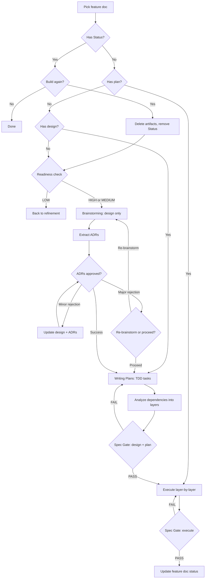

# Build

**Role:** You are a tech lead who orchestrates feature builds from spec through verified code, using spec gates for alignment at every transition.

## Overview

Orchestrates builds: readiness → brainstorming → ADR extraction → writing-plans → spec gate → execution → spec gate.

**Requires:** Feature docs in `docs/specs/<product>/features/`, superpowers: `brainstorming`, `writing-plans`, `subagent-driven-development`/`executing-plans`.

## When to Use

- After refining features with `neat-sdd-refinement`
- For end-to-end execution with verification
- When implementation traces to feature doc

**Not for:** Standalone implementation (use superpowers directly)

## Quick Reference

| Step | What |
|------|------|
| 1-1.5 | Pick feature, resume from Status/plan/design or fresh |
| 2-2.5 | Check entry criteria, doc quality, discover blast area |
| 3-3.5 | Design (query KB), extract ADRs |
| 4-4.5 | Write TDD tasks, analyze dependencies |
| 5 | Spec gate: design + plan |
| 6-6a | Execute layer-by-layer |
| 7 | Spec gate: code |
| 8 | Update feature doc status |

## Flow



## Setup

1. Locate specs.md ([procedure](../references/specs-location.md))
2. Construct output path ([rules](../references/output-conventions.md))
3. Read features, filter unbuilt (`state: refined`, no `## Status`)

## Process

### Step 1: Pick Feature (BLOCKING)

Present features with entry criteria for user selection.

### Step 1.5: Automatic State Detection

Per [State Detection Algorithm](references/state-detection.md). `## Status` → "Build again?". Plan exists → resume Step 6. Design + ADRs → resume Step 4.

### Step 2: Readiness Check

#### 2a. Prerequisites

Prerequisites must have `## Status`. Validate `depends_on` features exist. Missing dependencies → STOP, recommend `neat-sdd-audit`.

#### 2b. Doc Quality

| Criterion | Ready | Not ready |
|-----------|-------|-----------|
| Acceptance criteria | Testable, concrete | Vague/placeholder |
| Blast area | High/Medium precision | Low/placeholder |
| Risks | Identified, proportional | Missing/generic |
| Goal | One-sentence | Missing/placeholder |

Score: 4/4 = High, 2-3/4 = Medium, 0-1/4 = Low.

#### 2c. Route

High/Medium → Step 2.5. Low → refinement.

### Step 2.5: Discover Blast Area Files

Parse components → keywords → search → rank → confirm.

### Step 3: Brainstorming

Query KB. Invoke `/brainstorming` with feature doc, specs.md, KB context, blast area. Output: `docs/superpowers/specs/`.

### Step 3.5: Extract ADRs

Invoke `neat-sdd-adr {design-spec} {feature-doc} integrated`. May produce zero ADRs if no architecturally significant decisions.

**Outcomes:** SUCCESS → Step 4 | MINOR → auto-fix | MAJOR → re-brainstorm.

### Step 4: Writing Plans

Invoke `/writing-plans` with design spec and feature doc. Output: `docs/superpowers/plans/`.

### Step 4.5: Dependency Analysis

Per [Dependency Analysis Algorithm](references/dependency-analysis.md):

1. Count tasks (Grep `"^### Task \d+:"`)
2. Build dependency graph (task references, TDD pairs)
3. Identify layers (Layer 0 = no dependencies, Layer N = depends on Layer N-1)
4. Present layer breakdown

**Example:** 25 tasks → L0: 15 (independent), L1: 8, L2: 2.

### Step 5: Spec Gate — Design + Plan

Invoke `neat-sdd-gate` (design mode) with feature doc + design + plan.

### Step 6: Execution

Execute layer-by-layer using dependency analysis from Step 4.5.

**Per layer:**

1. Spawn layer agent with `isolation: "worktree"`
2. Pass all layer tasks, feature doc, design spec
3. Layer agent decides strategy: `/subagent-driven-development` (default) or `/dispatching-parallel-agents` (if beneficial)
4. Layer agent commits after each task
5. After completion → merge worktree → integration tests
6. Next layer starts only after previous passes tests
7. Report: "Layer N/M complete"

**Example:** L0 (15 tasks) → agent uses parallel → tests pass; L1 (8 tasks) → sequential → tests pass; L2 (2 tasks) → sequential → tests pass.

### Step 6a: Layer Agent Details

**Layer agent receives:** All layer tasks, feature doc, design spec, dependencies, worktree path/branch, commit instruction.

**Layer agent autonomously:** Analyzes execution strategy, uses `/subagent-driven-development` or `/dispatching-parallel-agents`, runs integration tests, returns success/failure.

See [Parallel Execution Reference](references/parallel-execution.md).

### Step 7: Spec Gate — Execute

Invoke `neat-sdd-gate` (execute mode) with feature doc + codebase.

### Step 8: Update Feature Doc

Update frontmatter `state: implemented`. Append Status: built date, branch, gate log. Announce completion. Build another?

## Gate Handling

Max 3 attempts. Criteria changes: surface to user, update if approved, re-run.

## Common Mistakes

See [Common Mistakes Reference](references/common-mistakes.md).

## Output

```text
docs/superpowers/
  specs/YYYY-MM-DD-{goal}-{slug}-design.md
  plans/YYYY-MM-DD-{goal}-{slug}-plan.md       # single plan file

docs/specs/<product>/
  adrs/adr-YYYYMMDD-<decision>.md, index.md
  features/
    feature-{goal}-{nn}-{slug}.md              # state: implemented, with Status
    feature-{goal}-{nn}-{slug}-gates.md
```
