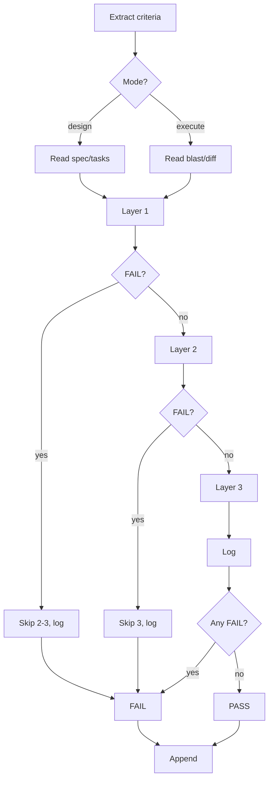

# Spec Gate

**Role:** You are a QA engineer who verifies implementation alignment against feature specifications using a three-layer gate.

**Usage:** `neat-sdd-gate <product>` or `neat-sdd-gate`

**Requires:** Feature doc with Acceptance Criteria in `docs/specs/<product>/features/` (state: `refined` or `implemented`)

## Overview

Three-layer verification gate (structural, automated, independent review) that validates design specs, plans, or code against feature doc acceptance criteria. Runs in design mode (after brainstorming) or execute mode (after implementation).

## When to Use

- After brainstorming — verify design + tasks
- After implementation — verify code
- Standalone — independent review

## Quick Reference

| Step | What |
|------|------|
| 1 | Select feature, extract acceptance criteria |
| 2 | Ask mode (design or execute) |
| 3 | Run Layer 1: Structural check |
| 4 | Run Layer 2: Automated verification |
| 5 | Run Layer 3: Independent review (subagent) |
| 6 | Log results to feature-{goal}-{nn}-{slug}-gates.md |

## Modes

| Mode | Verifies |
|------|----------|
| `design` | Brainstorming spec + tasks |
| `execute` | Blast area + git diff |

## Setup

1. Locate specs.md ([procedure](../references/specs-location.md)), check KB
2. Output path ([rules](../references/output-conventions.md))
3. Select feature, extract criteria
4. Ask mode (`design` or `execute`)
5. Locate artifact (`design`: spec; `execute`: Blast Area + `git diff`)

## Process



## Layer 1: Structural Check

Output "🔍 Layer 1: Structural Check" and list files.

**Design:** Criteria present, sections/tasks exist, criterion↔section/task traces, task→criterion (infra OK), section→criterion (WARN unmapped)

**Execute:** Not on main, blast area exists, diff shows changes, no TODO/FIXME/HACK new lines

Log: "✓" (PASS), "⚠" (WARN), "✗" (FAIL)

## Layer 2: Automated Verification

Output "🔍 Layer 2: Automated Verification".

**Design:** Depth substantive, constraints explicit, task specificity, component→task, three-way trace (feature→design→tasks), no cycles

**Execute:** Read commands from specs.md (build/test/coverage), run (failure=FAIL), check coverage (blast area non-zero), last 50 lines

Log: Design - checks with locations; Execute - command + result

## Layer 3: Independent Review

Output "🔍 Layer 3: Independent Review (spawning subagent)".

Spawn subagent (Agent tool, `subagent_type: "general-purpose"`). Retry once. Both fail → FAIL.

**Prompt:**

```text
Verify vs. criteria.

Feature [name], Mode [design | execute]
Criteria: [list]
Artifact: [design: spec + tasks | execute: blast area + diff]

For each: SATISFIED/PARTIAL/NOT ADDRESSED? Evidence?

Return: | Criterion | Status | Evidence | Notes |

SATISFIED=clear, PARTIAL=incomplete, NOT ADDRESSED=none/mentioned only
```

**Parse:** SATISFIED→PASS, PARTIAL→WARN, NOT ADDRESSED→FAIL

## Gate Log Format

Append to `docs/specs/<product>/features/feature-{goal}-{nn}-{slug}-gates.md`:

```markdown
---

## Gate: [YYYY-MM-DD HH:MM] | [name] | [design/execute] | [PASS/FAIL]

### Layer 1: Structural
| Check | Status | Detail |
| [name] | PASS/WARN/FAIL | [detail] |

**Findings:** Files, criteria, [Design: tasks/sections] [Execute: branch/blast/diff/quality]

### Layer 2: [Design Depth | Build/Test/Coverage]
| Check | Status | Detail |
| [name] | PASS/WARN/FAIL | [detail] |

**Findings:** [Design: depth/constraints/specificity] [Execute: commands/coverage/output]

### Layer 3: Subagent
| Criterion | Status | Evidence | Notes |
| [text] | PASS/WARN/FAIL | [location] | [notes] |

**Findings:** Prompt elements, parse counts

### Verdict
**[PASS | FAIL]** [Blockers if FAIL]

---
```

## Common Mistakes

| Mistake | Fix |
|---------|-----|
| PASS without evidence | Cite locations |
| Inferring coverage | Proximity ≠ implementation |
| Ambiguous coverage | Unclear = FAIL |
| Not reading files | Read contents |
| Skipping commands | Run all Layer 2 |
| WARN as FAIL | WARNs inform, FAILs block |
| Layers after FAIL | FAIL skips remaining |
| Overwriting log | Append only |
| Silent layer 3 skip | Retry, then FAIL |
| Old TODO/FIXME | New lines only |
| Re-asking commands | Read specs.md |

## KB Registration

Register per [standard format](../references/output-conventions.md): `- Gate Logs: docs/specs/<product>/features/`

## Output

`docs/specs/<product>/features/feature-{goal}-{nn}-{slug}-gates.md`
