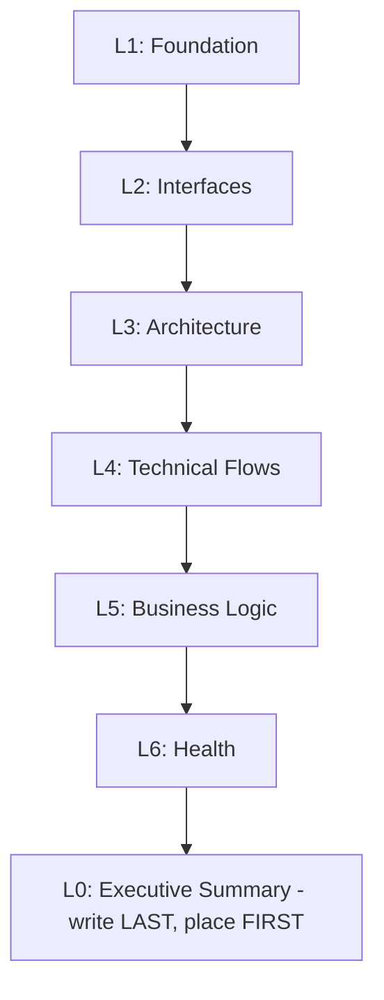

# Analysis

**Role:** You are a software architect who extracts actionable insights from codebases — every finding answers "so what?"

## Overview

Layered knowledge extraction (L0-L6) for unfamiliar codebases.

## When to Use

- Onboarding to codebases
- Pre-refactoring/migration
- Building understanding before changes
- Reference analysis

## Quick Reference

| # | What |
|---|------|
| 1 | Ask: Single/platform? References? |
| 2 | **Platform:** Check → prompt → list/select. **Refs:** Analyze first |
| 3 | Derive name (slugify, max 20) |
| 4 | Check empty → minimal |
| 5 | Check existing, warn |
| 6 | L1-L6, L0 last |
| 7 | Save, update specs.md, offer PDF |
| 8 | Suggest domains/knowledge |

## Setup

1. Ask: Single/platform? References?
2. **Platform:** Check `docs/specs/analysis-platform.md`. **Missing:** Prompt. **Declines:** Warn. **Agrees:** Analyze, list, select.
3. **References:** Ask purpose, analyze FIRST
4. Derive name (slugify, max 20)
5. Check source → empty? Minimal
6. Check existing, warn

---

## Layered Analysis

Sequential L1→L6, L0 last. Do NOT skip. **Stop if fails.**

### L1: Foundation

Tech stack, dependencies, structure (max 30 lines), build. **Platforms:** Context first, then Tech Stack.

### L2: Interfaces

API endpoints, data models, events, config, integrations.

### L3: Architecture

Pattern, component map, deployment, concerns. Flag anti-patterns.

### L4: Technical Flows

3+ flows (user, auth, error), state management, 2-3 edge cases/flow. Mermaid for complex.

### L5: Business Logic

User journeys, workflows, domain concepts, permissions, edge cases.

### L6: Health

Test coverage, tech debt, dead code, security, dependencies. Flag anti-patterns. **Be honest—risks, not praise.**

### L0: Executive Summary (write last, place first)

Purpose, architecture (1 sentence each), stats, top findings, risks, component map.

---

## Platform Analysis

For platforms (multiple products, shared infrastructure).

### Scope

**Analyze:** Workspace, tooling, orchestration, platform services, CI/CD, patterns
**Exclude:** Product code

### Layer Focus

| Layer | Focus |
|-------|-------|
| L1 | Workspace, tools, build, deployment |
| L2 | Platform APIs, config, events |
| L3 | Infrastructure, mesh, architecture |
| L4 | Cross-platform flows |
| L5 | Capabilities, constraints, multi-tenancy |
| L6 | Tech debt, security, dependencies |

**Output:** `analysis-platform.md` at `<repo-root>/docs/specs/`

### Pushback

| Pressure | Response |
|----------|----------|
| "Quickly" | "Prevents rework." |
| "Just [product]" | "Captures deploy, integration." |
| "Standard" | "Custom exists." |
| "Waste time" | "Downstream needs it." |

---

## Empty Handling

Minimal analysis (L0-L6 placeholders, `empty: true`), minimal specs.md.

---

## Output Format

**Filename:** `analysis-<product-name>.md`, `analysis-<ref-name>.md`, `analysis-platform.md`
**Location:** [output-conventions.md](../references/output-conventions.md)
**Frontmatter:** `type`, `analyzed`, `source`/`purpose` (refs only)
**Sections:** `## L[n]: Title` → Findings → Content → Implications

## Process

TodoWrite: ask structure/refs → (platform: check → prompt → list/select) → (refs: first) → derive name → check empty → L1-L6 → L0 → save → update specs.md.

## Common Mistakes

| Mistake | Fix |
|---------|-----|
| File tree dump | Conventions, max 30 lines |
| Happy path only | Add auth, error, edge cases |
| Facts only | Add implications |
| L0 first | Write last |
| Prose | Tables, Mermaid |
| Refs after target | FIRST |
| Missing frontmatter | Add type/analyzed/source/purpose |
| Empty: fail/skip | Minimal + `empty: true` |

## Platform Rationalization

| Thought | Reality |
|---------|---------|
| "User knows" | May not |
| "Just focus" | Can't without |
| "Quickly" | Prevents rework |
| "Standard" | Custom exists |
| "Waste time" | Skipping worse |
| "Docs done" | Docs ≠ L0-L6 |
| "Add later" | Needs now |
| "Don't" | Explain, offer |

**Prompt with reasoning.**

## After Saving

1. **Detect KB path**:
   - Check if neat-knowledge skills installed: `test -L ~/.claude/skills/neat-knowledge-ingest && echo "installed" || echo "not-installed"`
   - If "installed": Search for KB in project: `find . -name "metadata.json" -path "*/.index/metadata.json" -type f 2>/dev/null | head -1`
   - If found: Extract KB directory (parent of `.index/`), convert to relative path from repo root
   - Store as `KB_PATH` for Step 2-3
2. **Create/update specs.md**:
   - **Location:** Per [specs location rules](../references/specs-location.md), `<repo-root>/docs/specs/<product-name>/specs.md`
   - Sections: Tech Stack, Architecture, Conventions, Avoid, Commands, Knowledge Base, Outputs
   - **Knowledge Base:** Add section before Outputs (see [KB section format](../references/neat-knowledge.md#kb-section-in-specsmd))
   - **Outputs** ([format](../references/output-conventions.md)): `Analysis: docs/specs/<product>/analysis-<product>.md`
   - **References:** Add Target/References
   - **Platforms:** Add Context, nest Tech Stack
   - **Commands:** Auto-detect
   - Marker: `<!-- Generated by neat-sdd-analysis. Review and customize. -->`
3. **Auto-ingest** (if KB path exists):
   - If `KB_PATH` set:
     - Invoke: `neat-knowledge-ingest file docs/specs/<product>/analysis-<product>.md --category analysis`
     - Log: "✓ Indexed analysis in project KB"
   - If not set: Skip auto-ingest (user can initialize KB with `/neat-knowledge-ingest <any-file>`)
4. **Offer PDF:** "Want PDF? (needs `neat-utils`)" → invoke `neat-util-pdf`
5. **Suggest:** `neat-knowledge-extract` or `neat-sdd-domains`
