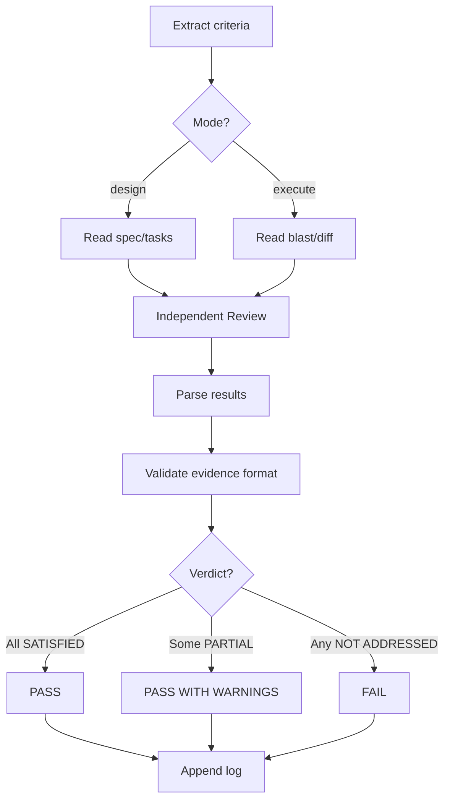

# Spec Gate

**Role:** You are a QA engineer who verifies implementation alignment against feature specifications using independent AI review.

**Usage:**

```bash
neat-sdd-gate <product>  # Auto-detects mode based on artifacts
neat-sdd-gate            # Prompts for product if ambiguous
```

**Requires:**

- Feature doc with Acceptance Criteria in `docs/specs/<product>/features/` (state: `refined` or `implemented`)
- **Design mode:** Design spec + task list must exist
- **Execute mode:** Blast area file + git diff with changes must exist

## Overview

Independent AI review that validates design specs, plans, or code against feature doc acceptance criteria. Runs in design mode (after brainstorming) or execute mode (after implementation).

**Note:** When invoked by `neat-sdd-build`, risk assessment determines if the gate runs (medium/high-risk features only). Low-risk features skip gates. Standalone invocation always runs the gate regardless of risk level.

## When to Use

- After brainstorming — verify design + tasks
- After implementation — verify code
- Standalone — independent review

## Quick Reference

| Step | What |
|------|------|
| 1 | Select feature, extract acceptance criteria |
| 2 | Detect mode (design or execute) |
| 3 | Read artifacts (design: spec + tasks; execute: blast area + diff) |
| 4 | Run Independent Review (subagent) |
| 5 | Log results to feature-{goal}-{nn}-{slug}-gates.md |

## Modes

| Mode | Verifies |
|------|----------|
| `design` | Brainstorming spec + tasks |
| `execute` | Blast area + git diff |

## Setup

1. Locate specs.md ([procedure](../references/specs-location.md)), check KB
2. Output path ([rules](../references/output-conventions.md))
3. Select feature, extract criteria
4. Detect mode automatically:
   - Blast area file exists + git diff shows changes → `execute`
   - Feature state=refined, no implementation → `design`
   - Ambiguous → ask user to clarify
5. Read artifacts (YOU must read, not just locate):
   - design mode: Read spec + tasks with Read tool
   - execute mode: Read blast area + run `git diff` for full changes

## Process



## Independent Review

Output "🔍 Independent Review (spawning subagent)".

Spawn subagent (Agent tool, `subagent_type: "general-purpose"`, `model: "haiku"`).

**Retry procedure:** Retry once on failure. Retry means same model, same prompt, fresh subagent spawn. Do not modify prompt or model. Both fail → FAIL.

**Prompt:**

```text
Verify implementation against acceptance criteria.

Feature: [name]
Mode: [design | execute]

Acceptance Criteria:
[numbered list of criteria]

Artifact to Review:
[design mode: design spec + task list]
[execute mode: blast area summary + git diff]

For each criterion, determine:
- SATISFIED: Clearly implemented with evidence
- PARTIAL: Incomplete or partially addressed
- NOT ADDRESSED: Missing or only mentioned

Return markdown table:
| Criterion | Status | Evidence | Notes |
|-----------|--------|----------|-------|
| [criterion text] | SATISFIED/PARTIAL/NOT ADDRESSED | [file:line or section reference] | [brief explanation] |

Evidence MUST use file:line or file:line-line format.
Examples:
✓ auth.js:45-67
✓ README.md:12
✗ "implemented in auth.js"
✗ "handled by authentication"
```

**Parse:** SATISFIED→PASS, PARTIAL→WARN, NOT ADDRESSED→FAIL

**Validation:** Verify all SATISFIED entries have file:line evidence format. Missing format = auto-downgrade to PARTIAL.

**Malformed output:** If subagent returns malformed output or missing table, treat all criteria as FAIL and note parsing failure in verdict.

**Performance optimization:** Uses Haiku model for fast, cost-effective review.

IMPORTANT: Do NOT use Sonnet/Opus for this task. Haiku is sufficient because:

1. Criteria are explicit (clear yes/no)
2. Artifacts are concrete (code/specs)
3. Task is mechanical (matching criteria to evidence)
4. Volume matters (gates run frequently)

Using stronger models wastes resources without improving accuracy.

## Gate Log Format

Append to `docs/specs/<product>/features/feature-{goal}-{nn}-{slug}-gates.md`:

```markdown
---

## Gate: [YYYY-MM-DD HH:MM] | [name] | [design/execute] | [PASS/PASS WITH WARNINGS/FAIL]

### Independent Review

| Criterion | Status | Evidence | Notes |
| [text] | PASS/WARN/FAIL | [location] | [notes] |

**Summary:** [X] criteria reviewed, [Y] PASS, [Z] WARN, [A] FAIL

### Verdict

**[PASS | PASS WITH WARNINGS | FAIL]**
- PASS: All SATISFIED
- PASS WITH WARNINGS: Some PARTIAL, no NOT ADDRESSED
- FAIL: Any NOT ADDRESSED

[List blockers if FAIL, improvements needed if WARNINGS]

---
```

## Common Mistakes

| Mistake | Fix |
|---------|-----|
| PASS without evidence | Cite exact file:line locations |
| Inferring coverage | Proximity ≠ implementation, must see actual code |
| Ambiguous coverage | Unclear = FAIL |
| Not reading artifacts | YOU must read artifacts before spawning subagent. Passing file paths to subagent = FAIL |
| WARN as FAIL | WARNs inform, FAILs block |
| Overwriting log | Append only |
| Silent retry skip | Retry once, then FAIL |
| Generic evidence | "Tests exist" → "test/auth.test.ts:45-67" |
| Using Sonnet/Opus | Use Haiku only, task is mechanical |
| Skipping validation | Verify file:line format in all SATISFIED entries |

## KB Registration

Register per [standard format](../references/output-conventions.md): `- Gate Logs: docs/specs/<product>/features/`

## Output

`docs/specs/<product>/features/feature-{goal}-{nn}-{slug}-gates.md`
